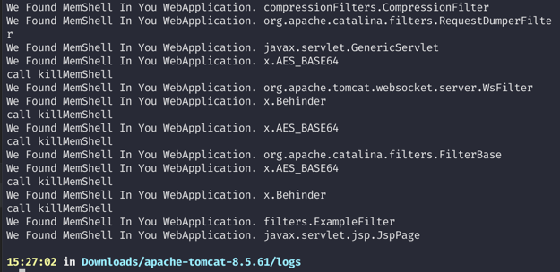

# aLIEz

2024-1-5: 一看commit记录，三年前的项目了，三年后改了一些代码，现在不依赖系统tools.jar了，也不会直接transformer去改bytecode了
          现在是直接dump出来自己分析

杀内存马的

java -jar aLIEz.jar JVMID aLIEz-agent-1.0-SNAPSHOT.jar




使用方法
````
➜ java -jar aLIEz.jar
usage: java -jar clearMemShell.jar <JVMID> "AgentLocate"
32866: org.jetbrains.idea.maven.server.RemoteMavenServer36
43237: org.jetbrains.jps.cmdline.Launcher /Applications/IntelliJ IDEA.app/Contents/lib/netty-common-4.1.52.Final.jar:/Applications/IntelliJ IDEA.app/Contents/lib/netty-resolver-4.1.52.Final.jar:/Applications/IntelliJ IDEA.app/Contents/plugins/java/lib/javac2.jar:/Applications/IntelliJ IDEA.app/Contents/lib/httpclient-4.5.12.jar:/Applications/IntelliJ IDEA.app/Contents/lib/plexus-component-annotations-1.7.1.jar:/Applications/IntelliJ IDEA.app/Contents/lib/maven-resolver-spi-1.3.3.jar:/Applications/IntelliJ IDEA.app/Contents/lib/util.jar:/Applications/IntelliJ IDEA.app/Contents/lib/platform-api.jar:/Applications/IntelliJ IDEA.app/Contents/lib/qdox-2.0-M10.jar:/Applications/IntelliJ IDEA.app/Contents/lib/asm-all-9.0.jar:/Applications/IntelliJ IDEA.app/Contents/lib/commons-lang3-3.10.jar:/Applications/IntelliJ IDEA.app/Contents/lib/jna.jar:/Applications/IntelliJ IDEA.app/Contents/lib/trove4j.jar:/Applications/IntelliJ IDEA.app/Contents/lib/nanoxml-2.2.3.jar:/Applications/IntelliJ IDEA.app/Contents/lib/maven-resolver-api
45253: org.jetbrains.idea.maven.server.RemoteMavenServer36
69401: org.jetbrains.idea.maven.server.RemoteMavenServer36
51529: Behinder_v3.0_Beta6_mac.jar
56185: org.apache.catalina.startup.Bootstrap start
57449: aLIEz.jar
37197:
64783: org.jetbrains.idea.maven.server.RemoteMavenServer36
56879: Godzilla-V2.96.jar

15:18:23 in out/artifacts/aLIEz_jar
➜ java -jar aLIEz.jar 56185 "/Users/r00t4dm/Downloads/JavaAgent_CleanMemShell/target/aLIEz-agent-1.0-SNAPSHOT.jar"
[+]OK.i find a jvm.org.apache.catalina.startup.Bootstrap start
[+]agent is injected.
